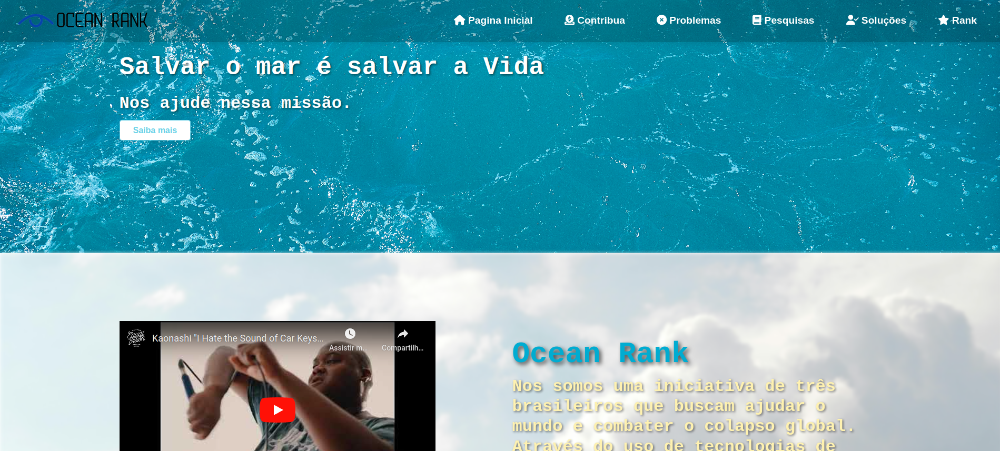

[JAVASCRIPT__BADGE]: https://img.shields.io/badge/Javascript-000?style=for-the-badge&logo=javascript
[REACT__BADGE]: https://img.shields.io/badge/React-005CFE?style=for-the-badge&logo=react
[PROJECT__BADGE]: https://img.shields.io/badge/📱Visit_this_project-000?style=for-the-badge&logo=project
[PROJECT__URL]: https://github.com/guilhermefaj/ocean-rank
[FIGMA__BADGE]: https://img.shields.io/badge/figma-%23F24E1E.svg?style=for-the-badge&logo=figma&logoColor=white
<h1 align="center" style="font-weight: bold;">Ocean Rank ⭐</h1>

![Figma][FIGMA__BADGE]


![javascript][JAVASCRIPT__BADGE]


![react][REACT__BADGE]


<p align="center" style="margin-right: 20px;">
  <a href="#about">Sobre</a> • 
  <a href="#started">Getting Started</a> • 
  <a href="#routes">Rotas da aplicação</a> • 
  <a href="#colab">Colaboradores</a>
</p>

<p align="center">
    
</p>

<h2 id="started">📌 Sobre</h2>

Ocean Rank é um projeto criado com o intuito de propor ideias de conceitização e descentralização de informações para ajudar na salvação do nosso planeta 🌎.

[![project][PROJECT__BADGE]][PROJECT__URL]

<h2 id="started">🚀 Getting started</h2>

Para rodar esse projeto você precisa atender os requisitos e instruções abaixo.

<h3>Pre requisitos</h3>

Aqui uma lista de todos os requisitos nescessários para rodar o projeto

- [NodeJS](https://github.com/)
- [Git 2](https://github.com)

<h3>Clonando</h3>

Como clonar o projeto

```bash
git clone https://github.com/guilhermefaj/ocean-rank
```

<h3>Iniciando</h3>

Como iniciar o projeto

```bash
cd project-name
npm install
npm run dev
```

<h2 id="routes">📍 Rotas da aplicação</h2>

​
| Rota              | Descrição                                          
|----------------------|-----------------------------------------------------
| <kbd>/</kbd>     | pagina inical
| <kbd>/problema</kbd>     | Pagina que destaca e aborda o problema
| <kbd>/pesquisa</kbd>     | Pagina que informa as pesquisas realizas 
| <kbd>/solucao</kbd>     |  Demontra e argumenta a solução
| <kbd>/doacao</kbd>     | Pagina para doação de verbas para a instituição
| <kbd>/rank</kbd>     | pagina do nosso rank
| <kbd>/*</kbd>     | pagina do 404, qualquer url digitada que não faça parte do component App ira cair aqui


<h2 id="colab">🤝 Colaboradores</h2>

Um obrigado especial ao time de desenvolvimento do projeto.

<table>
  <tr>
    <td align="center">
      <a href="https://github.com/joaovbrocchi">
        <br>
        <sub>
          <b>João Brocchi</b>
        </sub>
      </a>
    </td>
    <td align="center">
      <a href="https://github.com/Hattensz">
        <br>
        <sub>
          <b>Giovanna Hatten</b>
        </sub>
      </a>
    </td>
    <td align="center">
      <a href="https://github.com/guilhermefaj">
        <br>
        <sub>
          <b>Guilherme Junqueira</b>
        </sub>
      </a>
    </td>
  </tr>
</table>


<h3>Documentações que podem ajudar</h3>

[📝 How to create a Pull Request](https://www.atlassian.com/br/git/tutorials/making-a-pull-request)

[💾 Commit pattern](https://gist.github.com/joshbuchea/6f47e86d2510bce28f8e7f42ae84c716)